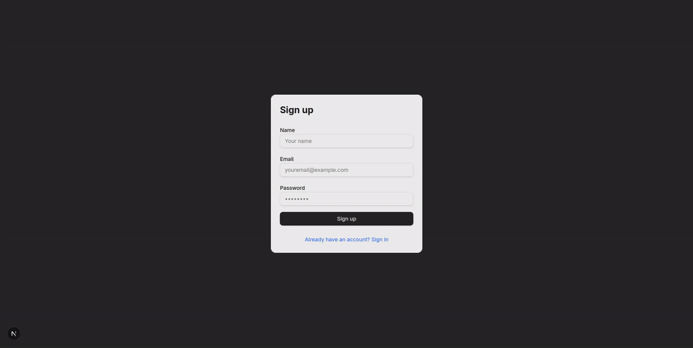
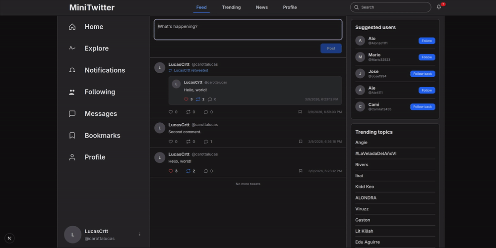
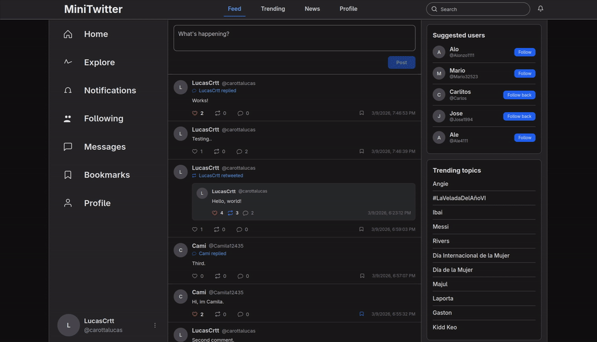
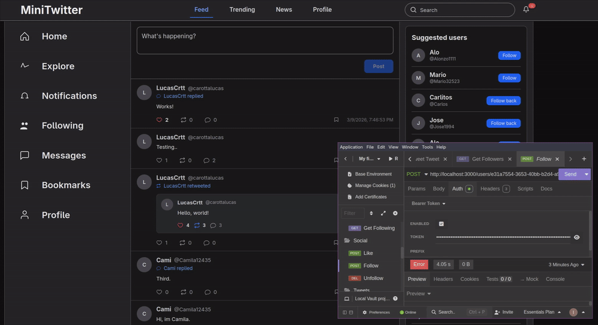
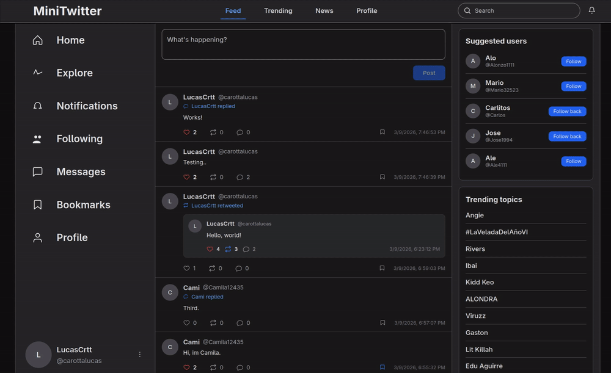
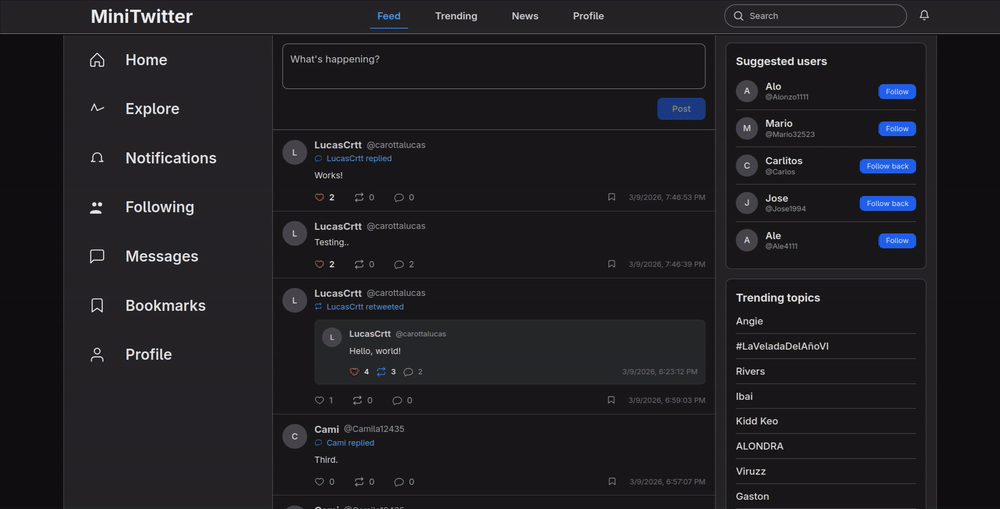

# Frontend estilo Twitter (Next.js) — 


## Descripción del proyecto

Proyecto desarrollado con fines de aprendizaje. Consiste en una aplicación web inspirada en Twitter, con un enfoque minimalista que prioriza las funcionalidades y la arquitectura por sobre el diseño visual.

El frontend fue desarrollado con Next.js (App Router) y se comunica con una API backend a través de rutas proxy. La aplicación implementa una interfaz responsiva y accesible, e incluye funcionalidades como autenticación de usuarios, feed de publicaciones, perfiles, creación de tweets, marcadores (bookmarks), notificaciones y comportamientos cercanos al tiempo real.

## Stack Tecnológico

- Framework: Next.js (App Router)
- Lenguaje: TypeScript
- UI: React 19, Tailwind CSS (v4), componentes personalizados
- HTML5/CSS3
- Autenticación: NextAuth (gestión de sesiones)
- Utilidades y estilos: Tailwind CSS, class-variance-authority, clsx
- Iconos: lucide-react
- Realtime / Sockets: socket.io-client (cuando aplica)
- Herramientas: ESLint, TypeScript
- Despliegue: listo para Vercel / Node (despliegue estándar de Next.js)

## Funcionalidades principales implementadas

- Flujos de autenticación: registro, login, refresh de tokens, logout y UI dependiente de sesión

	
- Feed y paginación: feed infinito con paginación por cursor y normalización de distintas respuestas del backend

	
- Acciones sobre tweets: crear tweet, responder, dar like, retweet y marcar como favorito (bookmark)

	
- Perfiles: ver perfiles de usuario, seguir/dejar de seguir, contadores y listado de seguidores/siguiendo

	
- Notificaciones: en tiempo real, listado paginado de notificaciones, marcar como leídas y enlaces profundos a contenido

	
- Bookmarks: listar, añadir y eliminar marcadores por tweet

	
- Tendencias y usuarios sugeridos: normalización de respuestas y componentes UI dedicados

	
- Tipos compartidos: carpeta `types/` consolidando interfaces TypeScript (Tweet, User/Profile, Notification, TrendingTopic)
- Biblioteca de componentes: conjunto pequeño de componentes reutilizables (`Button`, `Card`, `Input`) con variantes via `class-variance-authority`
- Fetch robusto: helpers en `lib/` (`tweetsClient`, `bookmarksClient`) que normalizan distintas formas de respuesta
- Accesibilidad: elementos semánticos y estilos `focus-visible` en controles interactivos

## Detalles técnicos relevantes

- App Router: Estructura con `app/` y separación entre componentes server/client según conviene.
- Typescript-first: Modelos de dominio centralizados en `types/` y usados en componentes y librerías.
- Normalización: Se normalizan distintas formas de respuesta del backend en el cliente (por ejemplo, `normalizeTweet`).
- Fallbacks de avatar: Se muestran iniciales cuando no hay avatar real; además se ignoran avatares generados automáticamente (dicebear/identicon/gravatar) para mostrar iniciales más consistentes.
- Mejora progresiva: Componentes que muestran placeholders y estados de carga mientras esperan datos.
- Proxy de API: El frontend llama a `/api/proxy/*` para facilitar CORS, uso de cookies de auth y adaptación de respuestas.

## Proxy de API

El frontend utiliza rutas proxy locales bajo `/api/proxy/*` para reenviar solicitudes al servidor backend (configurado mediante la variable de entorno `BACKEND_URL`).

El proxy se usa para:

- Simplificar el manejo de CORS evitando llamadas cross-origin desde el navegador.
- Mantener las cookies de autenticación en el mismo origen y facilitar su envío automático en las peticiones.
- Centralizar la normalización y adaptación de respuestas del backend antes de que la UI las consuma.

Esto permite a la aplicación frontend consumir una API más estable y consistente sin exponer detalles de la implementación del backend.

## Estructura destacada del repositorio

- `app/` — Rutas y páginas de Next.js (App Router)
- `components/` — Componentes UI reutilizables (TweetCard, ProfileCard, FollowButton, NotificationsPage, etc.)
- `lib/` — Helpers de fetch y utilidades (`tweetsClient`, `bookmarksClient`, `normalizeTweet`)
- `types/` — Interfaces TypeScript centralizadas (`tweet.ts`, `user.ts`, `notification.ts`, `trending.ts`)
- `public/` — Activos estáticos

## Scripts disponibles

Ejecutar desde `package.json`:

```
npm run dev      # iniciar servidor de desarrollo
npm run build    # compilar para producción
npm run start    # iniciar la app compilada (puerto por defecto 3001)
npm run lint     # ejecutar ESLint
```

## Retos y aprendizajes

- Manejar formas inconsistentes de respuesta desde el backend y normalizarlas en el cliente.
- Integrar NextAuth y gestionar límites entre código server y client.
- Equilibrar interactividad cliente (actualizaciones optimistas para follow/like/bookmark) con la consistencia eventual del servidor.
- Implementar scroll infinito y paginación basada en cursor.


## Cómo ejecutar localmente

1. Copiar el ejemplo de entorno:

```bash
cp .env.example .env.local
```

2. Instalar y ejecutar:

```bash
npm install
npm run dev
```

3. Abrir `http://localhost:3000`

## Notas / Contacto

Este frontend forma parte de un proyecto full-stack. Los endpoints del backend se consumen a través de `/api/proxy/*` y requieren un backend compatible. 
